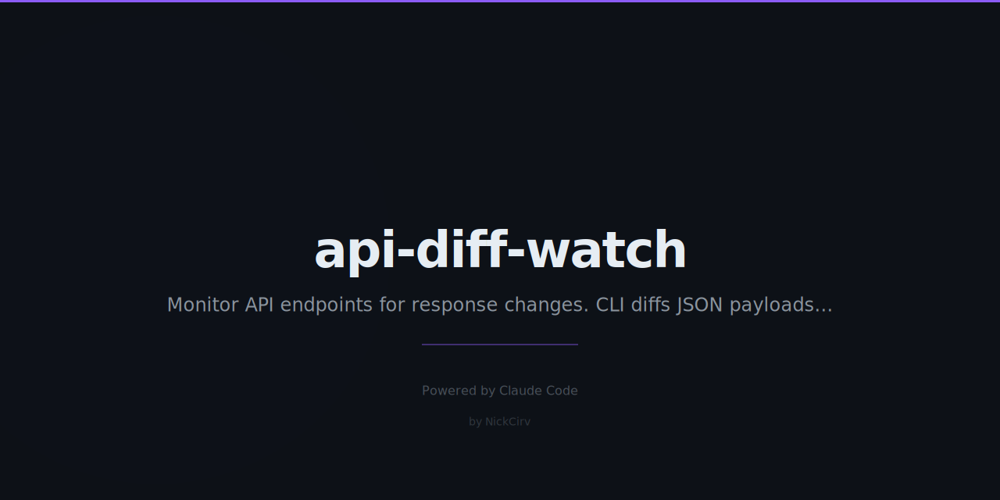

# api-diff-watch

> Watch API endpoints. Alert when responses change. Zero dependencies.

```
⚡ Change detected at 14:32:05
  ~ /data/users/0/email: "old@email.com" → "new@email.com"
  ~ /data/meta/count: 42 → 43
  + /data/meta/updatedAt (new field)
```

## Install

```bash
# Run directly with npx (no install needed)
npx api-diff-watch <url> [options]

# Or install globally
npm install -g api-diff-watch
```

## Quick Start

```bash
# Watch an endpoint every 30s
adw https://api.example.com/users

# Watch every 60s
adw https://api.example.com/users --interval 60

# Authenticated endpoint — reads from env, never logs the value
adw https://api.example.com/me --header "Authorization: Bearer $API_TOKEN"

# Only alert when the JSON schema changes (new/removed fields)
adw https://api.example.com/data --schema-only

# Watch a specific JSON path
adw https://api.example.com/feed --jq ".data.items"

# Ignore noisy fields like timestamps
adw https://api.example.com/status --ignore ".timestamp,.requestId"

# POST request
adw https://api.graphql.com/graphql --method POST --body '{"query":"{ users { id } }"}'

# Run a command when something changes
adw https://api.example.com/data --on-change "npm run sync"

# Log all changes to a file
adw https://api.example.com/feed --log changes.json

# One-shot: compare to saved baseline, exit 0 (no change) or 1 (changed)
adw https://api.example.com/status --once
```

## Options

| Flag | Default | Description |
|------|---------|-------------|
| `--interval <sec>` | `30` | Poll interval in seconds |
| `--header <Name: value>` | — | Add request header. Supports `$ENV_VAR` for secrets |
| `--method <METHOD>` | `GET` | HTTP method |
| `--body <json>` | — | Request body for POST/PUT |
| `--jq <path>` | — | Watch a specific JSON path (e.g. `.data.users`) |
| `--ignore <fields>` | — | Comma-separated fields to skip (e.g. `.timestamp,.id`) |
| `--schema-only` | `false` | Only alert on schema changes, not value changes |
| `--timeout <ms>` | `10000` | Per-request timeout |
| `--on-change <cmd>` | — | Run command on change (no shell — safe from injection) |
| `--log <file>` | — | Append all changes to a JSON file |
| `--once` | `false` | Fetch once, compare to baseline, exit 0/1 |

## How It Works

1. **First run** — fetches the endpoint and saves a baseline to `.adw-baseline/` (MD5 hash + pretty JSON)
2. **Subsequent runs** — compares the new response to the baseline
3. **Change detected** — prints a structured diff and updates the baseline
4. **No change** — prints timestamp + response time and continues

### Change Output Format

```
⚡ Change detected at 14:32:05
  ~ /data/users/0/email: "old@email.com" → "new@email.com"   ← yellow: changed
  + /data/meta/updatedAt (new field)                          ← green:  added
  - /data/legacy/token (removed)                              ← red:    removed
```

For non-JSON responses, a unified diff is shown instead.

### Schema-Only Mode

`--schema-only` only alerts when the structure of the JSON changes — new or removed keys, not value changes. Useful for API versioning surveillance.

### Security

- Secrets in `--header` are read from `process.env` and **never logged or echoed**
- `--on-change` uses `spawnSync` (no shell) — no command injection possible
- No network calls except to the URL you specify
- Baselines stored locally in `.adw-baseline/`

## CI / Scripting

Use `--once` in scripts or CI pipelines:

```bash
# Exit 1 if the API response changed since last run
adw https://api.example.com/schema --once --schema-only
echo $?  # 0 = no change, 1 = changed
```

## Why?

- No bloated monitoring platforms for simple "did this endpoint change?" checks
- Zero npm dependencies — nothing to audit, nothing to update, nothing to break
- Works in CI, Docker, cron jobs — no daemon required
- Schema-only mode catches API breaking changes before your code does

## Requirements

- Node.js 18+
- No external dependencies

---

Built with Node.js · Zero dependencies · MIT License
