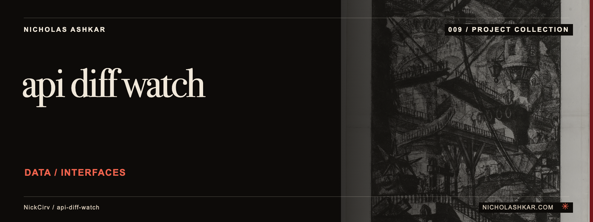

# api-diff-watch

Polls an HTTP endpoint and compares responses against a saved baseline.


<a id="usage"></a>

<a id="watch-an-endpoint-every-30-s-default"></a>

<a id="watch-every-60-s-with-an-auth-header-read-from-env"></a>

<a id="alert-only-when-the-json-schema-changes-new--removed-fields"></a>

## What it does

- JSON-path selection.
- Ignored fields and schema-only mode.
- Request headers and timeouts.
- Optional change log.


<a id="install"></a>

<a id="run-directly--no-install-needed"></a>

<a id="or-install-globally"></a>

## Quickstart

Prerequisites: Node.js `>=18` and npm. The checkout below pins the source used for this documentation.

```sh
git clone https://github.com/NickCirv/api-diff-watch.git
cd api-diff-watch
git checkout efc00a00457e390bdb3ed023f272ab97e5efba34
node index.js http://localhost:3000/status --once
```

**Expected behavior (illustrative, not captured):** Against a running local service, saves a first baseline or compares with an existing one; a changed comparison exits 1.

Examples are source-inspected, **not runtime-tested**. See the research record for verification gaps.

## Boundaries and data

Baselines persist locally and can include response data. --on-change launches a command using space-split arguments, not a shell. Polling observes snapshots and can miss changes between requests.

For continuous polling, always specify `--interval 30` (or another deliberate value). The current omitted-flag default is interpreted as milliseconds despite help text describing seconds; see [polling-default defect](docs/REFERENCE.md#polling-default-defect).


<a id="watch-a-specific-json-path-and-ignore-noisy-timestamp-fields"></a>

<a id="one-shot-ci-check-exit-0--no-change-exit-1--changed"></a>

## Development

The manifest defines `npm test` as:

```sh
node --test
```

The captured suite is a smoke check, not end-to-end behavior coverage. Examples include “entry is valid JavaScript”, “--help exits 0”. Tests were not run for this documentation revision.

See [implementation and command reference](docs/REFERENCE.md) for the package scripts and inspected interfaces, and [research record](docs/RESEARCH.md) for the pinned source, document decisions and unresolved checks.

## License and contact

See [LICENSE](LICENSE) for the original terms and attribution. Legal text is unchanged.

[Nicholas Ashkar](https://nicholashkar.com/) · [Discuss a project](https://nicholashkar.com/#oxblood-contact)
